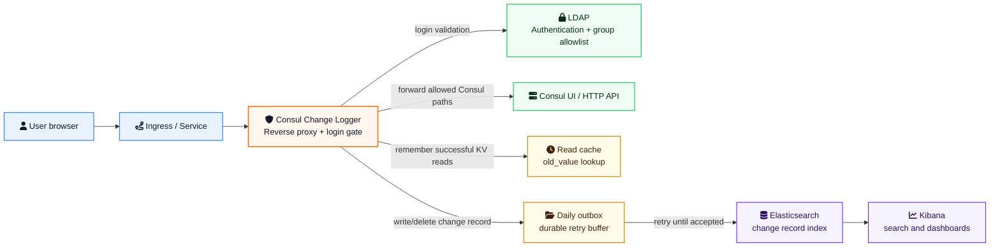

# Consul Change Logger

[](https://github.com/sinanakyazici/ConsulChangeLogger/actions/workflows/ci.yml)
[](LICENSE)
[](https://dotnet.microsoft.com/)
[](src/ConsulChangeLogger.Proxy/Dockerfile)

Consul Change Logger is a .NET reverse proxy that records Consul KV changes made through Consul UI/API traffic. It captures who changed which key, from which client, when it happened, and the best available old/new value pair.

It is intentionally focused on change logging. It does not replace Consul ACLs, it does not implement business approval workflows, and it does not produce generic access logs.

## Architecture



## Key Capabilities

- Login gate in front of Consul UI/API with `disabled`, `mock`, or `ldap` authentication modes.
- Consul KV write/delete change records with `user_email`, `client_ip`, `user_agent`, `request_id`, and `event_id`.
- Best-effort `old_value` capture from the user's previous KV read.
- Raw `new_value` capture from KV write requests.
- Daily durable outbox files for Elasticsearch retry and crash recovery.
- Runtime configuration from Consul KV for non-secret values.
- Docker Compose and Kubernetes sidecar examples.

## Change Record Example

```json
{
  "@timestamp": "2026-05-24T10:01:41Z",
  "event_id": "0473452922e74526b243cfb3c31ee3ee",
  "action": "kv_write",
  "kv_key": "test/test1",
  "old_value": "{ \"a\" : 1, \"b\": 2 }",
  "old_value_seen_at": "2026-05-24T10:01:33Z",
  "old_value_read_request_id": "2a3839ca1792427aa7d02483d5cc3ded",
  "new_value": "{ \"a\" : 1, \"b\": 2, \"c\": 1 }",
  "delete_confirmed": false,
  "success": true,
  "response_code": 200,
  "client_ip": "172.21.0.1",
  "user_email": "user@example.com",
  "user_agent": "Mozilla/5.0",
  "request_id": "0473452922e74526b243cfb3c31ee3ee",
  "source_path": "/v1/kv/test/test1?dc=dc1&flags=0",
  "source": "consul-change-logger"
}
```

## Security Model

- Keep Consul ACLs enabled in production. Consul Change Logger is not an authorization layer.
- Consul Change Logger records raw KV values by design. Do not store sensitive values in Consul KV if those values must not be indexed in Elasticsearch.
- `LDAP_BIND_PASSWORD` is read only from environment variables or secret-backed deployment configuration. It is not loaded from Consul KV.
- Terminate HTTPS at ingress or load balancer level and set `AUTH_COOKIE_SECURE=true`.
- Persist both the outbox path and data-protection key path when running more than a temporary local environment.
- Use `LDAP_GROUP_FILTER` in production so successful LDAP authentication is limited to an approved group.
- Keep Elasticsearch credentials in environment variables or Kubernetes Secrets, not in Consul KV.
- Login uses CSRF token validation, secure cookie settings, and standard browser hardening headers.

## Quick Start

The sample setup starts Consul, Elasticsearch, and Kibana as independent containers, then runs Consul Change Logger through Docker Compose.

```powershell
docker network create consul-change-logger-net

docker run -d --name elasticsearch --network consul-change-logger-net -p 9200:9200 `
  -e "discovery.type=single-node" `
  -e "xpack.security.enabled=false" `
  -e "ES_JAVA_OPTS=-Xms512m -Xmx512m" `
  docker.elastic.co/elasticsearch/elasticsearch:8.15.0

docker run -d --name kibana --network consul-change-logger-net -p 5601:5601 `
  -e "ELASTICSEARCH_HOSTS=http://elasticsearch:9200" `
  docker.elastic.co/kibana/kibana:8.15.0

docker run -d --name consul --network consul-change-logger-net `
  hashicorp/consul:1.19 agent -dev "-client=0.0.0.0" -ui
```

Seed runtime configuration into Consul KV:

```powershell
docker exec consul consul kv put consul-change-logger/config/LISTEN_PORT 8080
docker exec consul consul kv put consul-change-logger/config/CONSUL_ALLOWED_PATH_PREFIXES "/ui,/v1/kv,/v1/status,/v1/catalog,/v1/health,/v1/agent,/v1/internal"
docker exec consul consul kv put consul-change-logger/config/ELASTICSEARCH_URL http://elasticsearch:9200
docker exec consul consul kv put consul-change-logger/config/CHANGE_LOG_INDEX consul-change-logger
docker exec consul consul kv put consul-change-logger/config/CHANGE_LOG_OUTBOX_PATH /var/lib/consul-change-logger/outbox
docker exec consul consul kv put consul-change-logger/config/DATA_PROTECTION_PATH /var/lib/consul-change-logger/dp-keys
docker exec consul consul kv put consul-change-logger/config/READ_MATCH_WINDOW_SECONDS 1800
docker exec consul consul kv put consul-change-logger/config/MAX_BODY_BYTES 8192
docker exec consul consul kv put consul-change-logger/config/CHANGE_LOG_QUEUE_CAPACITY 1000
docker exec consul consul kv put consul-change-logger/config/CHANGE_LOG_RETENTION_DAYS 30
docker exec consul consul kv put consul-change-logger/config/ELASTICSEARCH_RETRY_DELAY_SECONDS 2
docker exec consul consul kv put consul-change-logger/config/AUTH_COOKIE_SECURE false
docker exec consul consul kv put consul-change-logger/config/AUTH_MODE mock
docker exec consul consul kv put consul-change-logger/config/AUTH_MOCK_PASSWORD Passw0rd!
docker exec consul consul kv put consul-change-logger/config/LDAP_URL ldap://ldap.example.com:389
docker exec consul consul kv put consul-change-logger/config/LDAP_BASE_DN dc=example,dc=com
docker exec consul consul kv put consul-change-logger/config/LDAP_USER_FILTER "(mail={0})"
docker exec consul consul kv put consul-change-logger/config/LDAP_GROUP_FILTER ""
docker exec consul consul kv delete consul-change-logger/config/LDAP_BIND_PASSWORD
```

Start Consul Change Logger:

```powershell
docker compose up -d --build
```

Open Consul UI through Consul Change Logger:

```text
http://localhost:8080/ui/
```

For local mock authentication, use any email address with this password:

```text
Passw0rd!
```

## Generate a Change Record

```powershell
$cookieJar = Join-Path $env:TEMP "consul-change-logger.cookies.txt"
curl.exe -c $cookieJar -d "email=user@example.com&password=Passw0rd!" http://localhost:8080/login
curl.exe -b $cookieJar -X PUT --data "{ \"a\" : 1, \"b\": 2 }" http://localhost:8080/v1/kv/demo/key
curl.exe -b $cookieJar http://localhost:8080/v1/kv/demo/key?raw
curl.exe -b $cookieJar -X PUT --data "{ \"a\" : 1, \"b\": 2, \"c\": 1 }" http://localhost:8080/v1/kv/demo/key
```

Query Elasticsearch:

```powershell
curl.exe "http://localhost:9200/consul-change-logger/_search?pretty&size=10&sort=@timestamp:desc"
```

In Kibana, create a data view for `consul-change-logger` and use `@timestamp` as the time field. Then open Discover and filter by fields such as `user_email`, `kv_key`, `action`, or `request_id`.

## Configuration

Bootstrap environment variables:

| Name | Default | Description |
| --- | --- | --- |
| `CONSUL_UPSTREAM_URL` | `http://consul:8500` | Consul HTTP endpoint used by the proxy and config loader. |
| `CONSUL_CONFIG_PREFIX` | `consul-change-logger/config` | Consul KV prefix for runtime configuration. |

Runtime configuration is loaded from Consul KV under `CONSUL_CONFIG_PREFIX`.

| Key | Default | Description |
| --- | --- | --- |
| `LISTEN_PORT` | `8080` | HTTP port exposed by Consul Change Logger. |
| `CONSUL_ALLOWED_PATH_PREFIXES` | `/ui,/v1/kv,/v1/status,/v1/catalog,/v1/health,/v1/agent,/v1/internal` | Consul path prefixes allowed after login. Non-KV mutations are blocked. |
| `ELASTICSEARCH_URL` | `http://elasticsearch:9200` | Elasticsearch endpoint. |
| `CHANGE_LOG_INDEX` | `consul-change-logger` | Elasticsearch index for change records. |
| `CHANGE_LOG_OUTBOX_PATH` | `/var/lib/consul-change-logger/outbox` | Durable local outbox directory. |
| `DATA_PROTECTION_PATH` | `/var/lib/consul-change-logger/dp-keys` | ASP.NET cookie key storage path. |
| `READ_MATCH_WINDOW_SECONDS` | `1800` | Time window for matching prior reads to later writes/deletes. |
| `MAX_BODY_BYTES` | `8192` | Maximum captured request/response body length. |
| `CHANGE_LOG_QUEUE_CAPACITY` | `1000` | In-memory queue capacity for Elasticsearch dispatch. |
| `CHANGE_LOG_RETENTION_DAYS` | `30` | Maximum number of daily outbox directories to retain. |
| `ELASTICSEARCH_RETRY_DELAY_SECONDS` | `2` | Retry delay after Elasticsearch delivery failure. |
| `AUTH_COOKIE_SECURE` | `false` | Set `true` when served through HTTPS. |
| `AUTH_MODE` | `disabled` | Authentication mode: `disabled`, `mock`, or `ldap`. |
| `AUTH_MOCK_PASSWORD` | `Passw0rd!` | Local mock authentication password. |
| `LDAP_URL` | `ldap://localhost:389` | LDAP/LDAPS endpoint. |
| `LDAP_BIND_DN` | empty | Optional LDAP search bind DN. |
| `LDAP_BASE_DN` | empty | LDAP search base DN. |
| `LDAP_USER_FILTER` | `(mail={0})` | LDAP user search filter. |
| `LDAP_GROUP_FILTER` | empty | Optional LDAP group allowlist filter. `{0}` is user DN, `{1}` is email. Example: `(&(objectClass=group)(cn=consul-admins)(member={0}))`. |

Secret environment variables:

| Name | Description |
| --- | --- |
| `LDAP_BIND_PASSWORD` | LDAP search bind password. Provide it through a secret-backed environment variable. |
| `ELASTICSEARCH_USERNAME` | Optional Elasticsearch basic auth username. |
| `ELASTICSEARCH_PASSWORD` | Optional Elasticsearch basic auth password. |
| `ELASTICSEARCH_API_KEY` | Optional Elasticsearch API key. Takes precedence over username/password. |

Use an `https://` `ELASTICSEARCH_URL` for TLS. If your Elasticsearch endpoint uses a private CA, mount the CA into the container trust store as part of your base image or deployment process.

## Health Checks

```text
/health/live
/health/ready
```

`/health/ready` checks Consul and Elasticsearch connectivity.

## Kubernetes

Example manifests are available under `k8s/`:

- `k8s/sidecar-snippet.yaml`
- `k8s/service-example.yaml`
- `k8s/pvc-example.yaml`
- `k8s/secret-example.yaml`
- `k8s/consul-config-seed.example.sh`

Step-by-step onboarding for an existing Kubernetes environment is available in [docs/kubernetes-onboarding-guide.md](docs/kubernetes-onboarding-guide.md).

For production deployments:

- route all Consul UI/API traffic through Consul Change Logger
- mount `CHANGE_LOG_OUTBOX_PATH` on persistent storage
- persist `DATA_PROTECTION_PATH`
- provide `LDAP_BIND_PASSWORD` from Kubernetes Secret or an equivalent secret provider
- provide Elasticsearch credentials from Kubernetes Secret when Elasticsearch security is enabled
- run the container as non-root with read-only root filesystem
- set `AUTH_COOKIE_SECURE=true`
- set `LDAP_GROUP_FILTER` to an approved group
- keep Consul ACLs enabled

## Development

Build:

```powershell
dotnet build ConsulChangeLogger.slnx
```

Run tests:

```powershell
dotnet run --project tests\ConsulChangeLogger.Tests\ConsulChangeLogger.Tests.csproj
```

Build the container image:

```powershell
docker build -f src\ConsulChangeLogger.Proxy\Dockerfile -t consul-change-logger:local .
```

## Repository Layout

```text
src/ConsulChangeLogger.Core      Shared models, configuration options, KV parsing helpers
src/ConsulChangeLogger.Proxy     ASP.NET Core reverse proxy, authentication, change delivery
tests/ConsulChangeLogger.Tests   Lightweight executable test runner
k8s                              Kubernetes examples
docs                             Additional design notes
```

## Known Limits

- `old_value` depends on a prior successful read through the same Consul Change Logger process by the same user/client/key identity.
- If read and write traffic is routed to different replicas, `old_value` can be `null` unless sticky routing or shared state is added.
- If the process restarts between read and write, `old_value` can be `null`.
- Large request and response bodies are truncated at `MAX_BODY_BYTES`.
- The current test project is a lightweight executable runner, not a standard xUnit/NUnit/MSTest project.

## License

MIT. See [LICENSE](LICENSE).
