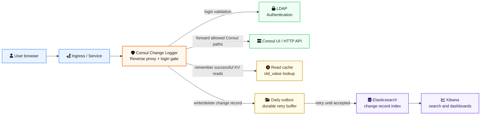

# Consul Change Logger

[](https://github.com/sinanakyazici/ConsulChangeLogger/actions/workflows/ci.yml)
[](LICENSE)
[](https://dotnet.microsoft.com/)
[](src/ConsulChangeLogger.Proxy/Dockerfile)

Consul Change Logger is a .NET reverse proxy that records Consul KV changes made through Consul UI/API traffic. It captures who changed which key, from which client, when it happened, and the best available old/new value pair.

It is intentionally focused on change logging. It does not replace Consul ACLs, it does not implement business approval workflows, and it does not produce generic access logs.

## Architecture



## Key Capabilities

- LDAP login gate in front of Consul UI/API.
- Consul KV write/delete change records with `user_email`, `client_ip`, `user_agent`, `request_id`, and `event_id`.
- Best-effort `old_value` capture from the user's previous KV read.
- Raw `new_value` capture from KV write requests.
- Daily durable outbox files for Elasticsearch retry and crash recovery.
- Runtime configuration, including LDAP and Elasticsearch credentials, from Consul KV.
- Docker Compose and Kubernetes sidecar examples.

## Change Record Example

```json
{
  "@timestamp": "2026-05-24T10:01:41Z",
  "event_id": "0473452922e74526b243cfb3c31ee3ee",
  "action": "kv_write",
  "kv_key": "test/test1",
  "old_value": "{ \"a\" : 1, \"b\": 2 }",
  "old_value_seen_at": "2026-05-24T10:01:33Z",
  "old_value_read_request_id": "2a3839ca1792427aa7d02483d5cc3ded",
  "new_value": "{ \"a\" : 1, \"b\": 2, \"c\": 1 }",
  "delete_confirmed": false,
  "success": true,
  "response_code": 200,
  "client_ip": "172.21.0.1",
  "user_email": "user@example.com",
  "user_agent": "Mozilla/5.0",
  "request_id": "0473452922e74526b243cfb3c31ee3ee",
  "source_path": "/v1/kv/test/test1?dc=dc1&flags=0",
  "source": "consul-change-logger"
}
```

## Security Model

- Keep Consul ACLs enabled in production. Consul Change Logger is not an authorization layer.
- Consul Change Logger records raw KV values by design. Do not store sensitive values in Consul KV if those values must not be indexed in Elasticsearch.
- All runtime values, including LDAP and Elasticsearch credentials, can be loaded from Consul KV.
- Terminate HTTPS at ingress or load balancer level.
- Persist the outbox path when running more than a temporary local environment.
- Restrict access to the Consul KV configuration prefix because it contains plaintext credentials.
- Login uses CSRF token validation, an in-memory session store, and standard browser hardening headers. The browser cookie contains only an opaque session id.

## Quick Start

The sample setup starts Consul, Elasticsearch, and Kibana as independent containers, then runs Consul Change Logger locally with .NET. This keeps the default bootstrap URL, `http://localhost:8500`, valid.

```powershell
docker network create consul-change-logger-net

docker run -d --name elasticsearch --network consul-change-logger-net -p 9200:9200 `
  -e "discovery.type=single-node" `
  -e "xpack.security.enabled=false" `
  -e "ES_JAVA_OPTS=-Xms512m -Xmx512m" `
  docker.elastic.co/elasticsearch/elasticsearch:8.15.0

docker run -d --name kibana --network consul-change-logger-net -p 5601:5601 `
  -e "ELASTICSEARCH_HOSTS=http://elasticsearch:9200" `
  docker.elastic.co/kibana/kibana:8.15.0

docker run -d --name consul --network consul-change-logger-net -p 8500:8500 `
  hashicorp/consul:1.19 agent -dev "-client=0.0.0.0" -ui
```

Seed runtime configuration into Consul KV:

```powershell
docker cp k8s/appsettings.consul.example.json consul:/tmp/appsettings.json
docker exec consul consul kv put consul-change-logger/appsettings.json @/tmp/appsettings.json
```

Start Consul Change Logger:

```powershell
dotnet run --project src\ConsulChangeLogger.Proxy\ConsulChangeLogger.Proxy.csproj
```

Open Consul UI through Consul Change Logger:

```text
http://localhost:8080/ui/
```

## Generate a Change Record

```powershell
$cookieJar = Join-Path $env:TEMP "consul-change-logger.cookies.txt"
curl.exe -c $cookieJar -d "email=ldap-user&password=ldap-password" http://localhost:8080/login
curl.exe -b $cookieJar -X PUT --data "{ \"a\" : 1, \"b\": 2 }" http://localhost:8080/v1/kv/demo/key
curl.exe -b $cookieJar http://localhost:8080/v1/kv/demo/key?raw
curl.exe -b $cookieJar -X PUT --data "{ \"a\" : 1, \"b\": 2, \"c\": 1 }" http://localhost:8080/v1/kv/demo/key
```

Query Elasticsearch:

```powershell
curl.exe "http://localhost:9200/consul-change-logger/_search?pretty&size=10&sort=@timestamp:desc"
```

In Kibana, create a data view for `consul-change-logger` and use `@timestamp` as the time field. Then open Discover and filter by fields such as `user_email`, `kv_key`, `action`, or `request_id`.

## Configuration

Bootstrap configuration is read from `src/ConsulChangeLogger.Proxy/appsettings.json`:

```json
{
  "ConsulConfiguration": {
    "UpstreamUrl": "http://localhost:8500",
    "ConfigKey": "consul-change-logger/appsettings.json"
  }
}
```

All runtime configuration is read from the Consul KV JSON document at `ConsulConfiguration.ConfigKey`. See [`k8s/appsettings.consul.example.json`](k8s/appsettings.consul.example.json) for the complete schema.

Use an `https://` `Elasticsearch.Url` for TLS. If your Elasticsearch endpoint uses a private CA, mount the CA into the container trust store as part of your base image or deployment process.

## Health Checks

```text
/health/live
/health/ready
```

`/health/ready` checks Consul and Elasticsearch connectivity.

## Kubernetes

Example manifests are available under `k8s/`:

- `k8s/sidecar-snippet.yaml`
- `k8s/service-example.yaml`
- `k8s/pvc-example.yaml`
- `k8s/appsettings.consul.example.json`
- `k8s/consul-config-seed.example.sh`

Step-by-step onboarding for an existing Kubernetes environment is available in [docs/kubernetes-onboarding-guide.md](docs/kubernetes-onboarding-guide.md).

For production deployments:

- route all Consul UI/API traffic through Consul Change Logger
- mount `ChangeLog.OutboxPath` on persistent storage
- enable Consul ACLs and limit read access to `consul-change-logger/appsettings.json`, which contains credentials
- run the container as non-root with read-only root filesystem
- keep Consul ACLs enabled

## Development

Build:

```powershell
dotnet build ConsulChangeLogger.slnx
```

Run tests:

```powershell
dotnet run --project tests\ConsulChangeLogger.Tests\ConsulChangeLogger.Tests.csproj
```

Build the container image:

```powershell
docker build -f src\ConsulChangeLogger.Proxy\Dockerfile -t consul-change-logger:local .
```

## Repository Layout

```text
src/ConsulChangeLogger.Core      Shared models, configuration options, KV parsing helpers
src/ConsulChangeLogger.Proxy     ASP.NET Core reverse proxy, authentication, change delivery
tests/ConsulChangeLogger.Tests   Lightweight executable test runner
k8s                              Kubernetes examples
docs                             Additional design notes
```

## Known Limits

- `old_value` depends on a prior successful read through the same Consul Change Logger process by the same user/client/key identity.
- If read and write traffic is routed to different replicas, `old_value` can be `null` unless sticky routing or shared state is added.
- If the process restarts between read and write, `old_value` can be `null`.
- Large request and response bodies are truncated at `ChangeLog.MaxBodyBytes`.
- The current test project is a lightweight executable runner, not a standard xUnit/NUnit/MSTest project.

## License

MIT. See [LICENSE](LICENSE).
