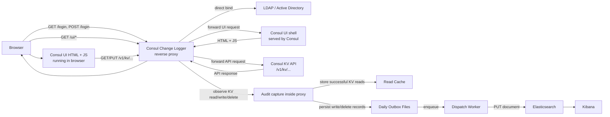

# Consul Change Logger

[](https://github.com/sinanakyazici/ConsulChangeLogger/actions/workflows/ci.yml)
[](LICENSE)
[](https://dotnet.microsoft.com/)
[](src/ConsulChangeLogger.Proxy/Dockerfile)

Consul Change Logger is an ASP.NET Core reverse proxy that sits in front of Consul UI and the Consul HTTP API, authenticates users with LDAP, forwards allowed traffic to Consul, and records Consul KV write and delete activity into Elasticsearch.

The product is intentionally narrow:

- it focuses on KV change logging, not generic access logging
- it does not replace Consul ACLs
- it does not implement approval workflows
- it does not modify KV payloads before they reach Consul

## What It Does

- Authenticates browser users with LDAP before they can access Consul UI or the Consul API through the proxy.
- Proxies Consul UI assets and API requests to the upstream Consul endpoint.
- Captures KV reads to build a best-effort `old_value`.
- Captures KV writes and deletes as audit records.
- Writes each audit record to a local outbox file before Elasticsearch delivery.
- Retries Elasticsearch delivery until the record is accepted.
- Adds JSON validation metadata for `old_value` and `new_value`.
- Shows a browser warning before saving a KV value that looks like JSON but is invalid JSON.

## End-to-End Flow



The important point is that audit logging happens inside the proxy while it is relaying Consul UI API traffic to Consul. The browser talks only to Consul Change Logger. Consul UI then triggers `/v1/kv/...` requests through that proxy path, and those requests are where reads are cached and writes/deletes are turned into audit records.

The architecture document contains a more detailed breakdown: [docs/architecture.md](docs/architecture.md)

## Authentication Model

Login uses direct LDAP bind. The value entered in the login form is sent directly as the LDAP bind identity.

Typical examples:

- `test.user@examplecorp.com`
- `service.account@company.com`

This matches environments where applications authenticate directly against Active Directory or another LDAP server using username and password, without first looking up the user DN through a search.

## Audit Record

Each KV write or delete can produce a document like this:

```json
{
  "@timestamp": "2026-06-16T10:03:13Z",
  "event_id": "2d0d2f599db54e01bfab9f5209250e6a",
  "action": "kv_write",
  "kv_key": "test/test1",
  "old_value": "{ \"a\" : 1 }",
  "old_value_looks_like_json": true,
  "old_value_json_validation_status": "valid_json",
  "old_value_is_valid_json": true,
  "old_value_json_error": null,
  "old_value_seen_at": "2026-06-16T10:02:00Z",
  "old_value_read_request_id": "ed27d99ba89e49ed9440a7638caabea2",
  "new_value": "{ \"a\" : 1 }",
  "new_value_looks_like_json": true,
  "new_value_json_validation_status": "valid_json",
  "new_value_is_valid_json": true,
  "new_value_json_error": null,
  "delete_confirmed": false,
  "success": true,
  "response_code": 200,
  "client_ip": "::1",
  "user_email": "test.user@examplecorp.com",
  "user_agent": "Mozilla/5.0",
  "request_id": "2d0d2f599db54e01bfab9f5209250e6a",
  "source_path": "/v1/kv/test/test1?dc=dc1&flags=0",
  "source": "consul-change-logger"
}
```

## JSON Validation

Consul Change Logger does not block invalid JSON on the server side. It records validation metadata and lets the operator decide what to do with that information.

Validation statuses:

- `not_json`
- `valid_json`
- `invalid_json`

Current heuristic:

- if the value starts with `{` or `[` after leading whitespace is removed, it is treated as JSON-like
- JSON-like values are parsed
- valid parse -> `valid_json`
- invalid parse -> `invalid_json`
- everything else -> `not_json`

Browser-side warning:

- when a user clicks save in Consul UI
- if the outgoing KV body looks like JSON but cannot be parsed
- the browser asks whether the user still wants to continue

The proxy still allows the write if the user confirms.

## Logging

Console logging is intentionally verbose in the current build so the whole request path can be followed during testing.

The proxy logs:

- login page requests
- login attempts
- LDAP bind success and failure
- proxied Consul requests
- upstream response status and byte counts
- KV read cache behavior
- audit record creation
- outbox writes
- queue and dispatch activity
- Elasticsearch index setup and document delivery
- invalid JSON detection

## Configuration

Bootstrap configuration is read from `src/ConsulChangeLogger.Proxy/appsettings.json`:

```json
{
  "ConsulConfiguration": {
    "UpstreamUrl": "http://localhost:8500",
    "ConfigKey": "consul-change-logger/appsettings.local.json"
  }
}
```

Runtime configuration is read from the Consul KV key referenced by `ConfigKey`.

Example runtime configuration:

```json
{
  "Elasticsearch": {
    "Url": "https://localhost:9200",
    "Username": "elastic",
    "Password": "your-password",
    "ApiKey": "",
    "Index": "consul-change-logger",
    "RetryDelaySeconds": 2,
    "SkipCertificateValidation": true
  },
  "ChangeLog": {
    "OutboxPath": ".local-data/outbox",
    "DataProtectionPath": ".local-data/data-protection",
    "ReadMatchWindowSeconds": 1800,
    "MaxBodyBytes": 8192,
    "QueueCapacity": 1000,
    "RetentionDays": 30
  },
  "LdapConfiguration": {
    "Domain": "localhost",
    "Port": 1389,
    "SecurePort": 1636,
    "BindDn": "svc-ldap-bind@examplecorp.com",
    "BindCredentials": "Passw0rd!123",
    "SearchBase": "OU=Accounts,OU=Region,OU=Organization,DC=examplecorp,DC=com",
    "SearchFilter": "(&(objectClass=user)(objectCategory=person)",
    "UseSSL": false
  }
}
```

Notes:

- `SearchFilter` is kept for compatibility and future lookup scenarios, but direct bind authentication does not require it during login.
- `BindDn` and `BindCredentials` are not used for login in direct bind mode. They are available for future LDAP search or enrichment scenarios.

## Local AD Test Environment

This repository now includes a Samba-based local Active Directory test environment for Kubernetes:

- [k8s/samba-ad.yaml](k8s/samba-ad.yaml)
- [k8s/samba-ad-ui.yaml](k8s/samba-ad-ui.yaml)

This environment provides:

- a local Samba AD-compatible LDAP endpoint
- a phpLDAPadmin UI
- a seeded OU structure
- a seeded service account
- a seeded test user

Test user:

```text
test.user@examplecorp.com
UserPass123!
```

Service account:

```text
svc-ldap-bind@examplecorp.com
Passw0rd!123
```

If you are using the local port-forward setup from this workspace, the endpoints are:

- LDAP: `localhost:1389`
- LDAPS: `localhost:1636`
- LDAP UI: `http://localhost:9081/`

## Elasticsearch and Kibana

The current default Elasticsearch index name is:

```text
consul-change-logger
```

Useful Kibana filters:

```text
action : "kv_write"
kv_key : "test/test1"
user_email : "test.user@examplecorp.com"
new_value_json_validation_status : "invalid_json"
```

If Discover is empty even though documents exist, create a data view for:

```text
consul-change-logger
```

with:

```text
@timestamp
```

as the time field.

## Health Endpoints

- `/health/live`
- `/health/ready`

`/health/ready` verifies Consul and Elasticsearch connectivity.

## Kubernetes

Kubernetes-related examples and notes:

- [k8s/sidecar-snippet.yaml](k8s/sidecar-snippet.yaml)
- [k8s/service-example.yaml](k8s/service-example.yaml)
- [k8s/pvc-example.yaml](k8s/pvc-example.yaml)
- [k8s/appsettings.consul.example.json](k8s/appsettings.consul.example.json)
- [k8s/consul-config-seed.example.sh](k8s/consul-config-seed.example.sh)
- [docs/kubernetes-onboarding-guide.md](docs/kubernetes-onboarding-guide.md)

## Security Notes

- Keep Consul ACLs enabled in production.
- Treat Consul KV runtime configuration as sensitive because it can contain plaintext credentials.
- Persist `ChangeLog.OutboxPath` if you need crash recovery across restarts.
- The product stores raw KV values in Elasticsearch by design.
- The login cookie contains only an opaque session id. No LDAP password is stored in the browser.

## Build

```powershell
dotnet build ConsulChangeLogger.slnx --configuration Release
```

## Repository Layout

```text
src/ConsulChangeLogger.Core      Shared models and KV helpers
src/ConsulChangeLogger.Proxy     Reverse proxy, auth, audit pipeline
tests/ConsulChangeLogger.Tests   Lightweight executable tests
k8s                              Kubernetes examples and local AD lab manifests
docs                             Architecture and onboarding docs
```

## License

MIT. See [LICENSE](LICENSE).
