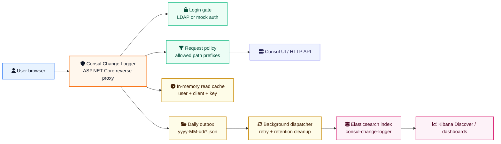
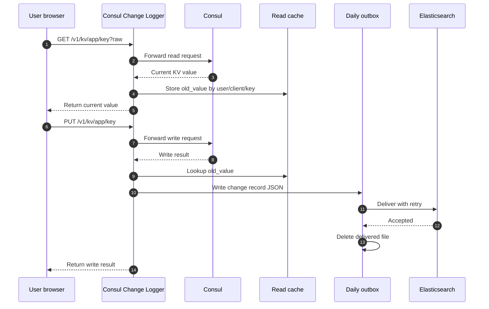
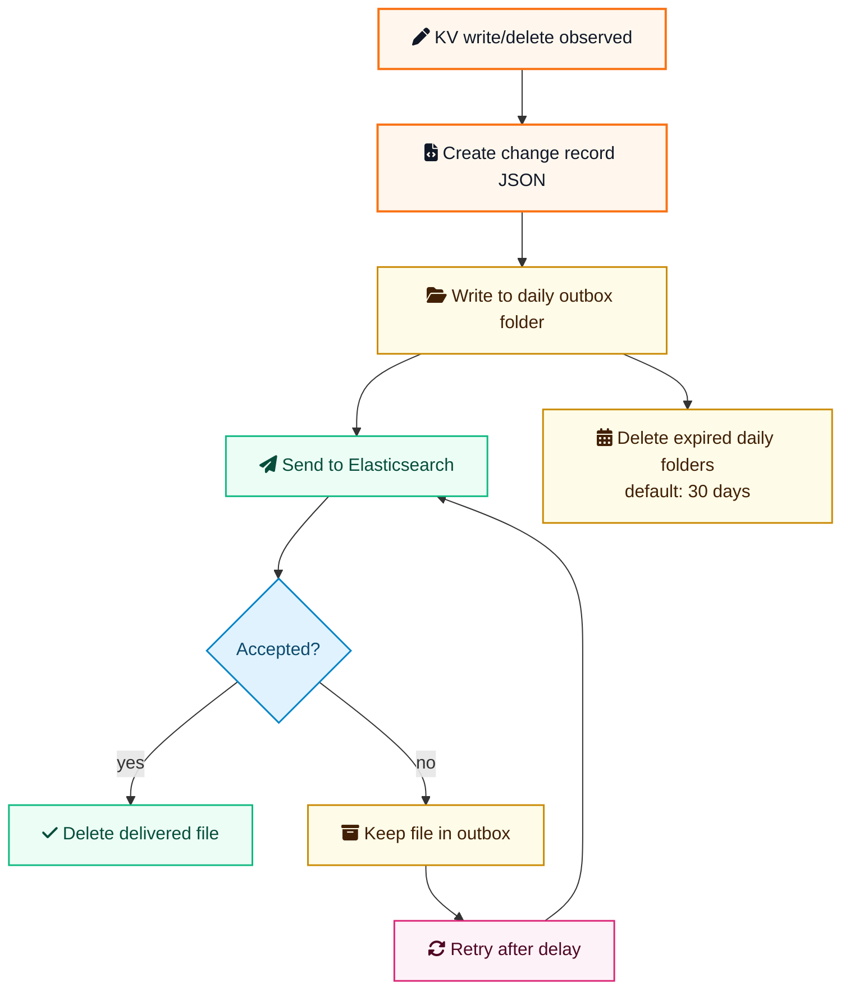

# Architecture

Consul Change Logger is an authenticated reverse proxy for Consul UI/API traffic. It records Consul KV write/delete events with user identity and best-effort old/new values.

## Projects

- `src/ConsulChangeLogger.Proxy`: ASP.NET Core app, login flow, Consul forwarding, change record delivery.
- `src/ConsulChangeLogger.Core`: shared models and KV parsing helpers.
- `tests/ConsulChangeLogger.Tests`: lightweight executable test runner for parsing edge cases.

## Old Value Capture

Consul Change Logger does not read Consul state before every write. It captures `old_value` from the latest successful KV read by the same user/client/key identity while the process is running.

This matches the Consul UI workflow where users read a KV value before changing it. If writes happen without a prior read through Consul Change Logger, `old_value` can be `null`.

## Delivery Guarantees

For each KV write/delete event:

1. write JSON to `CHANGE_LOG_OUTBOX_PATH`
2. enqueue the outbox file for Elasticsearch delivery
3. delete the outbox file only after Elasticsearch accepts it

Outbox files are stored under daily directories named `yyyy-MM-dd`. If Elasticsearch is unavailable, the background worker retries from the outbox. Expired daily directories are deleted according to `CHANGE_LOG_RETENTION_DAYS`, which defaults to 30 days. For production, mount `CHANGE_LOG_OUTBOX_PATH` on persistent storage.

## Configuration

Only bootstrap values are expected from environment variables:

- `CONSUL_UPSTREAM_URL`
- `CONSUL_CONFIG_PREFIX`

Non-secret runtime configuration is read from Consul KV under `CONSUL_CONFIG_PREFIX`.

Secret values must not be stored in Consul KV. `LDAP_BIND_PASSWORD`, `ELASTICSEARCH_USERNAME`, `ELASTICSEARCH_PASSWORD`, and `ELASTICSEARCH_API_KEY` are read only from the environment.

## Request Scope

After authentication, Consul Change Logger forwards only paths matching `CONSUL_ALLOWED_PATH_PREFIXES`. `GET` and `HEAD` are allowed for those prefixes. Mutating methods are allowed only for Consul KV paths, so non-KV Consul API mutations are blocked at the proxy layer. Consul ACLs are still required in production.
