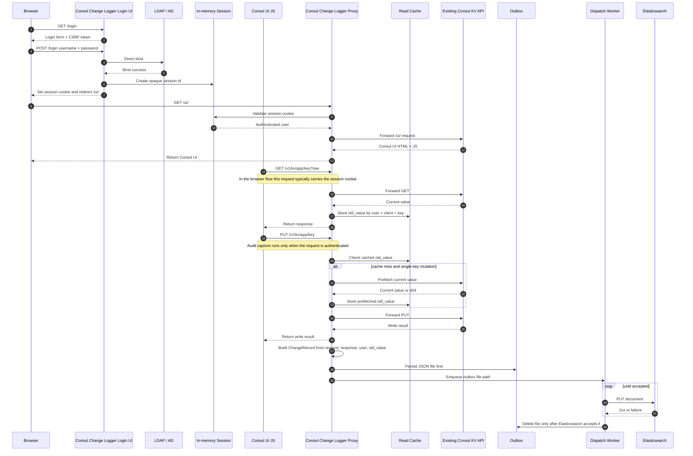
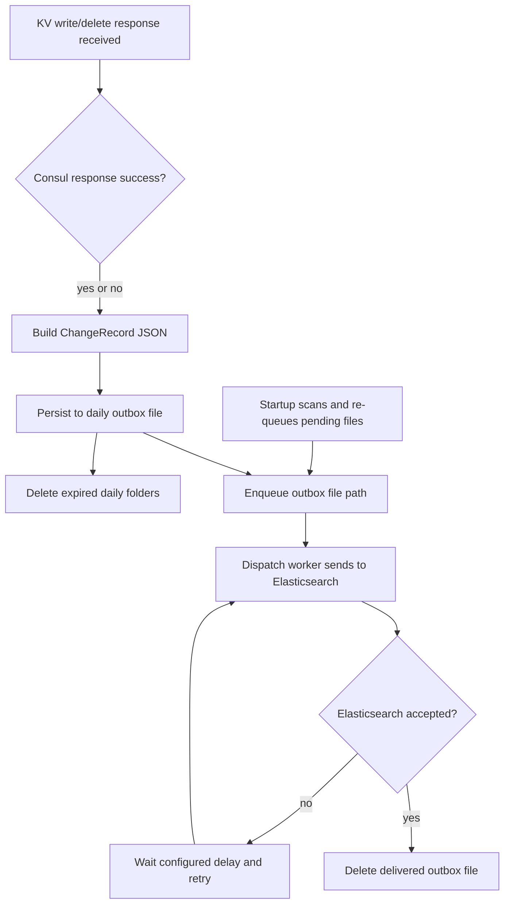

# Architecture

Consul Change Logger is an authenticated reverse proxy with an audit pipeline behind it. Its job is to sit in front of Consul UI and the Consul HTTP API, authenticate the user, forward the request to Consul, observe KV traffic, and persist normalized change records into Elasticsearch.

This document describes the current implementation, not a generic future design.

## High-Level View



The key detail is this:

- Consul UI itself does not write directly to Elasticsearch
- the browser loads the Consul UI through Consul Change Logger
- that UI then sends KV API requests such as `GET /v1/kv/...` and `PUT /v1/kv/...`
- those API calls pass through Consul Change Logger
- Consul Change Logger forwards them to Consul and, at the same time, creates audit data from the request and response

The diagram follows one continuous flow:

1. the browser opens the existing Consul UI address, which now routes to the Consul Change Logger gateway
2. `Consul Change Logger Login UI` serves the login page
3. LDAP / AD validates the submitted credentials with direct bind
4. a successful login creates an in-memory session and redirects the browser to `/ui/`
5. Consul UI JavaScript sends `/ui/*` and `/v1/kv/...` traffic through `Consul Change Logger Proxy`
6. `Consul Change Logger Proxy` forwards those calls to the existing Consul UI and Consul KV API
7. Consul responses return through the proxy to the browser
8. audit capture builds `ChangeRecord` documents and persists them to outbox first
9. Elasticsearch stores the records and Kibana visualizes them

## Deployment Model

Consul Change Logger runs as its own Kubernetes Deployment and Service. It is not injected into the Consul pod.

```text
Existing Consul hostname
        |
        v
Consul Change Logger Service
        |
        v
Existing Consul Service
```

This keeps the existing Consul installation independent from the product. The upstream Consul HTTP endpoint is configured through `CONSUL_UPSTREAM_URL`.

## Request Path

### 1. Authentication

The login form is served by the proxy itself.

Flow:

1. browser requests `/login`
2. proxy renders login page with CSRF token
3. browser posts username and password
4. proxy performs direct LDAP bind using the submitted identity
5. if bind succeeds, the proxy creates an in-memory session and sets an opaque cookie
6. browser is redirected to `/ui/`

Important properties:

- login uses direct bind
- the submitted username is used as the LDAP bind identity
- the session store is in memory
- the browser cookie stores only the session id
- when `AUTHENTICATION=false`, no session identity is created and audit capture is disabled

### 2. Consul UI and API forwarding

Current request boundary:

- requests to `/` and `/ui/*` require an authenticated browser session
- unauthenticated requests to `/v1/*` are forwarded to the Consul HTTP API without forcing a login
- unauthenticated `/v1/*` requests use a fast pass-through path and do not enter read cache, prefetch, audit capture, outbox, or Elasticsearch dispatch logic
- authenticated browser `/v1/kv/*` requests can be audited because they carry the UI session

The proxy copies request headers, body, and method, then writes the upstream response back to the browser.

Non-mutating UI/API traffic passes through as normal. Authenticated browser KV mutation traffic is additionally observed by the audit pipeline. Application traffic that calls `/v1/*` without the browser session is only proxied.

The practical browser flow is:

1. browser requests `/ui/` from Consul Change Logger
2. Consul Change Logger forwards that to the upstream Consul UI
3. browser receives Consul UI HTML and JavaScript through the proxy
4. that JavaScript later calls endpoints such as `/v1/kv/...`
5. those `/v1/kv/...` calls also go through Consul Change Logger
6. while forwarding them to Consul, the proxy inspects them for audit purposes

### 3. Client-side JSON warning

When the Consul UI HTML shell is returned, the proxy injects a small JavaScript file into the HTML response.

That script:

- intercepts `fetch` and `XMLHttpRequest`
- watches `PUT /v1/kv/...` requests
- checks whether the body looks like JSON
- if it looks like JSON but is invalid, shows a browser confirmation dialog

This is only a UI guard. The server still allows the request if the user confirms.

## Audit Pipeline



Authentication is part of the same browser request path. The browser cannot reach `/` or `/ui/*` through this product until the proxy has a valid in-memory session, unless `AUTHENTICATION=false` is explicitly configured. Requests to `/v1/*` are still passed through without forcing login so non-browser Consul clients are not blocked. When authentication is enabled, LDAP is used only for direct bind during login; later browser UI requests are authorized by the proxy session cookie.

### Read cache

`old_value` is best-effort.

The proxy uses two sources for `old_value`:

1. the latest successful KV read cached for the same identity
2. a prefetch before a single-key write or delete when no cached value exists

- authenticated username
- client IP
- user agent
- KV key

If the same identity later performs a write or delete for the same key, the cached or prefetched value becomes `old_value`.

This means:

- if there is no prior read and prefetch is not possible, `old_value` can be `null`
- if the process restarts, `old_value` can be `null`
- if traffic is split across replicas without shared state, `old_value` can be `null`
- if the mutation targets multiple keys or a non-standard path, prefetch is skipped

### ChangeRecord structure

Current fields include:

- event metadata:
  `@timestamp`, `event_id`, `request_id`, `action`, `source`, `source_path`
- KV metadata:
  `kv_key`, `is_folder`, `old_value`, `old_value_observed_at`, `new_value`, `new_value_json_error`, `is_create`, `is_update`, `is_delete`
- response metadata:
  `is_success`, `response_status_code`
- user context:
  `user_email`, `client_ip`, `user_agent`

Notes:

- `is_folder=true` when the Consul key ends with `/`
- `old_value` is best-effort and can be `null`
- `new_value_json_error` is populated only when the submitted new value looks like JSON but cannot be parsed

### JSON validation semantics

The proxy never rewrites or blocks the KV payload on the server side.

Current detection rule:

- if a value starts with `{` or `[` after trimming leading whitespace, it is treated as JSON-like
- JSON-like values are parsed
- failed parse -> `new_value_json_error` contains the parser message
- successful parse or non-JSON payload -> `new_value_json_error` is `null`

This means JSON primitives such as `true`, `123`, or `"text"` are treated as non-JSON by the current heuristic, so `new_value_json_error` remains `null`.

## Outbox and Delivery



Delivery rules:

1. build a `ChangeRecord` after the forwarded Consul write/delete response is available
2. write the record JSON to outbox before attempting Elasticsearch delivery
3. enqueue the outbox file path
4. let the background worker dispatch the document to Elasticsearch
5. delete the file only after Elasticsearch accepts the document
6. keep and retry the file if Elasticsearch is unavailable or rejects the request

At startup, the worker scans the outbox and re-queues any leftover files.

## Elasticsearch Integration

Current index name:

```text
consul-change-logger
```

Startup behavior:

1. load bootstrap configuration from local `appsettings.json` or environment variables
2. wait for Consul and load the runtime JSON document from Consul KV
3. if `AUTHENTICATION=true`, wait until LDAP is reachable
4. wait until Elasticsearch root endpoint is reachable
5. create the index if needed
6. update the mapping with the expected fields

Delivery model:

- one `ChangeRecord` becomes one Elasticsearch document
- document id uses `event_id` if present, otherwise `request_id`
- retries continue with the configured delay

## Logging Model

The proxy currently runs with verbose console logging enabled.

It logs:

- application startup
- LDAP bind attempts and results
- HTTP request summaries
- proxied upstream response details
- KV read cache hits
- audit record creation
- outbox persistence
- queue and dispatch lifecycle
- Elasticsearch health and index setup
- invalid JSON detection
- request cancellation and client disconnect behavior

## Runtime Configuration

The application reads bootstrap values from local `appsettings.json` or environment variables:

- `ConsulConfiguration.UpstreamUrl`
- `ConsulConfiguration.ConfigKey`
- `Authentication`

Environment variable equivalents also exist:

- `CONSUL_UPSTREAM_URL`
- `CONSUL_CONFIG_KEY`
- `AUTHENTICATION`

All remaining runtime settings come from the Consul KV JSON document referenced by `ConfigKey`.

This includes:

- Elasticsearch settings
- outbox settings
- LDAP settings

Because these values can contain plaintext credentials, Consul ACL policies must restrict access to the configuration key.

Current LDAP runtime behavior:

- login uses direct bind only
- `Domain`, `Port`, `SecurePort`, and `UseSSL` are actively used

If `UseSSL=true`, the current implementation uses TLS but accepts the LDAP server certificate through a permissive validation callback rather than enforcing strict certificate trust validation.

## Limits

- `old_value` is best-effort, not a guaranteed previous-state read
- direct bind login does not validate authorization groups
- the session store is in memory only
- JSON validation is heuristic for objects and arrays, not all JSON forms
- the client-side JSON warning works only for traffic that goes through the Consul UI in the browser
- server-side audit still allows invalid JSON writes if the user or calling client sends them
