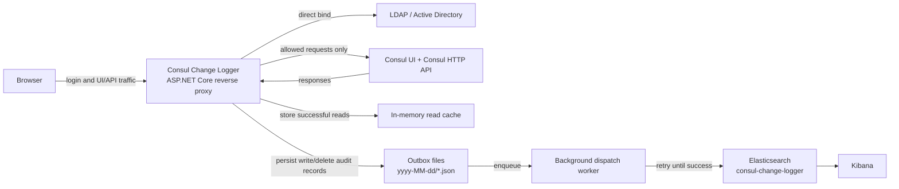
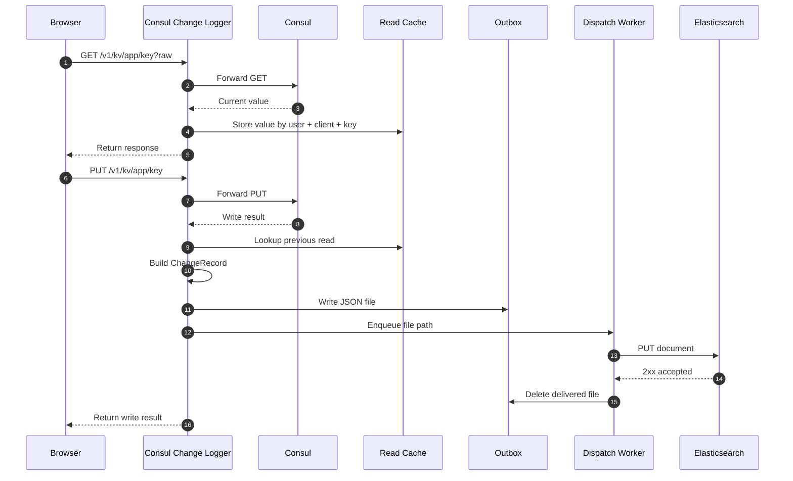
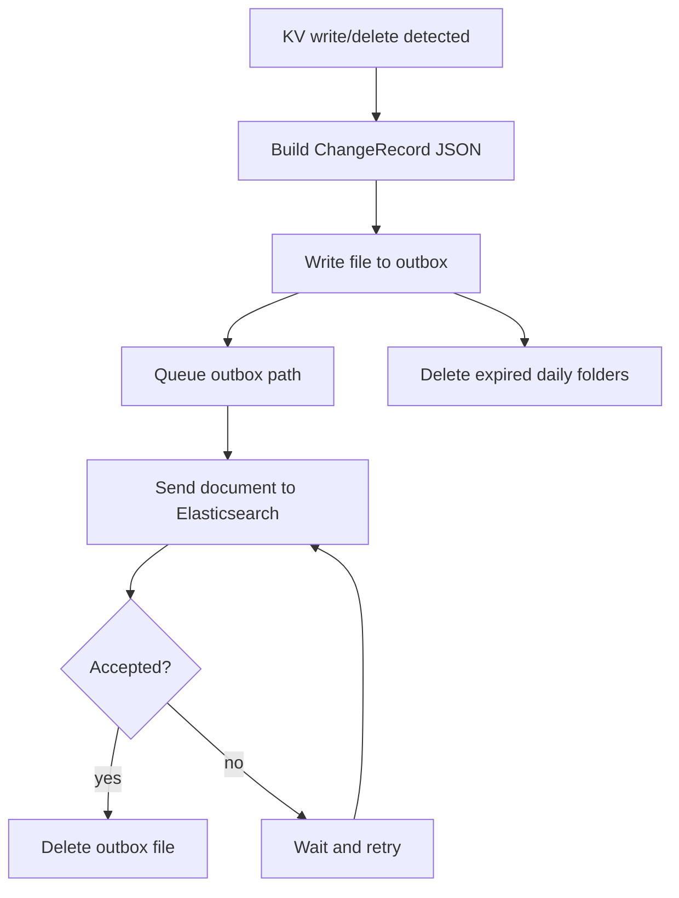

# Architecture

Consul Change Logger is an authenticated reverse proxy with an audit pipeline behind it. Its job is to sit in front of Consul UI and the Consul HTTP API, authenticate the user, forward the request to Consul, observe KV traffic, and persist normalized change records into Elasticsearch.

This document describes the current implementation, not a generic future design.

## High-Level View



## Request Path

### 1. Authentication

The login form is served by the proxy itself.

Flow:

1. browser requests `/login`
2. proxy renders login page with CSRF token
3. browser posts username and password
4. proxy performs direct LDAP bind using the submitted identity
5. if bind succeeds, the proxy creates an in-memory session and sets an opaque cookie
6. browser is redirected to `/ui/`

Important properties:

- login uses direct bind
- the submitted username is used as the LDAP bind identity
- the session store is in memory
- the browser cookie stores only the session id

### 2. Consul UI and API forwarding

After authentication:

- requests to `/ui/*` are forwarded to Consul UI
- requests to `/v1/*` are forwarded to the Consul HTTP API

The proxy copies request headers, body, and method, then writes the upstream response back to the browser.

Non-mutating UI/API traffic passes through as normal. KV mutation traffic is additionally observed by the audit pipeline.

### 3. Client-side JSON warning

When the Consul UI HTML shell is returned, the proxy injects a small JavaScript file into the HTML response.

That script:

- intercepts `fetch` and `XMLHttpRequest`
- watches `PUT /v1/kv/...` requests
- checks whether the body looks like JSON
- if it looks like JSON but is invalid, shows a browser confirmation dialog

This is only a UI guard. The server still allows the request if the user confirms.

## Audit Pipeline



### Read cache

`old_value` is best-effort.

The proxy does not fetch Consul state before every write. Instead, it caches the latest successful KV read using this identity model:

- authenticated username
- client IP
- user agent
- KV key

If the same identity later performs a write or delete for the same key, the cached read becomes `old_value`.

This means:

- if there is no prior read, `old_value` can be `null`
- if the process restarts, `old_value` can be `null`
- if traffic is split across replicas without shared state, `old_value` can be `null`

### ChangeRecord structure

Current fields include:

- event metadata:
  `@timestamp`, `event_id`, `request_id`, `action`, `source`, `source_path`
- KV metadata:
  `kv_key`, `old_value`, `new_value`, `delete_confirmed`
- response metadata:
  `success`, `response_code`
- user context:
  `user_email`, `client_ip`, `user_agent`
- old value tracking:
  `old_value_seen_at`, `old_value_read_request_id`
- JSON validation metadata:
  `old_value_looks_like_json`, `old_value_is_valid_json`, `old_value_json_error`, `old_value_json_validation_status`
  `new_value_looks_like_json`, `new_value_is_valid_json`, `new_value_json_error`, `new_value_json_validation_status`

### JSON validation semantics

The proxy never rewrites or blocks the KV payload on the server side.

Validation is informational:

- `not_json`
- `valid_json`
- `invalid_json`

Current detection rule:

- if a value starts with `{` or `[` after trimming leading whitespace, it is treated as JSON-like
- JSON-like values are parsed
- successful parse -> `valid_json`
- failed parse -> `invalid_json`
- everything else -> `not_json`

This means JSON primitives such as `true`, `123`, or `"text"` are currently classified as `not_json`, not `valid_json`.

## Outbox and Delivery



Delivery rules:

1. write record JSON to outbox first
2. enqueue file path
3. worker dispatches to Elasticsearch
4. only after Elasticsearch accepts the document is the file deleted
5. if Elasticsearch is unavailable, the file stays in outbox and is retried

At startup, the worker scans the outbox and re-queues any leftover files.

## Elasticsearch Integration

Current index name:

```text
consul-change-logger
```

Startup behavior:

1. wait until Elasticsearch root endpoint is reachable
2. create the index if needed
3. update the mapping with the expected fields

Delivery model:

- one `ChangeRecord` becomes one Elasticsearch document
- document id uses `event_id` if present, otherwise `request_id`
- retries continue with the configured delay

## Logging Model

The proxy currently runs with verbose console logging enabled.

It logs:

- application startup
- LDAP bind attempts and results
- HTTP request summaries
- proxied upstream response details
- KV read cache hits
- audit record creation
- outbox persistence
- queue and dispatch lifecycle
- Elasticsearch health and index setup
- invalid JSON detection
- request cancellation and client disconnect behavior

## Runtime Configuration

The application reads only bootstrap values from local `appsettings.json`:

- `ConsulConfiguration.UpstreamUrl`
- `ConsulConfiguration.ConfigKey`

All runtime settings come from the Consul KV JSON document referenced by `ConfigKey`.

This includes:

- Elasticsearch settings
- outbox settings
- LDAP settings

Because these values can contain plaintext credentials, Consul ACL policies must restrict access to the configuration key.

## Local AD Lab

This repository includes a local Samba-based AD lab under `k8s/`:

- `k8s/samba-ad.yaml`
- `k8s/samba-ad-ui.yaml`

This lab is for development and verification:

- direct LDAP bind testing
- AD-style `SearchBase`
- seeded service account
- seeded test user
- phpLDAPadmin access

Current seeded identities:

- `PLXTRTA-TST-IT001@pluxeegroup.com`
- `sinan.akyazici@pluxeegroup.com`

## Limits

- `old_value` is best-effort, not a guaranteed previous-state read
- direct bind login does not validate authorization groups
- the session store is in memory only
- JSON validation is heuristic for objects and arrays, not all JSON forms
- the client-side JSON warning works only for traffic that goes through the Consul UI in the browser
- server-side audit still allows invalid JSON writes if the user or calling client sends them
